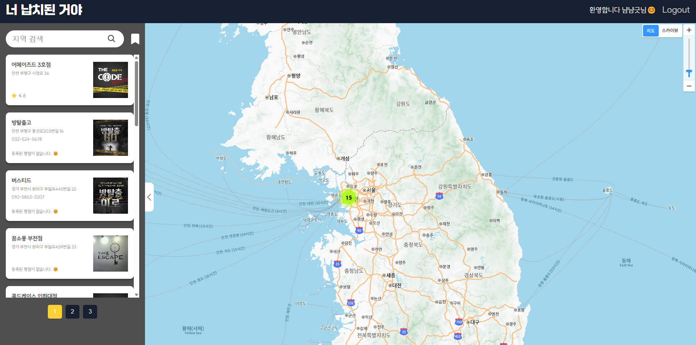
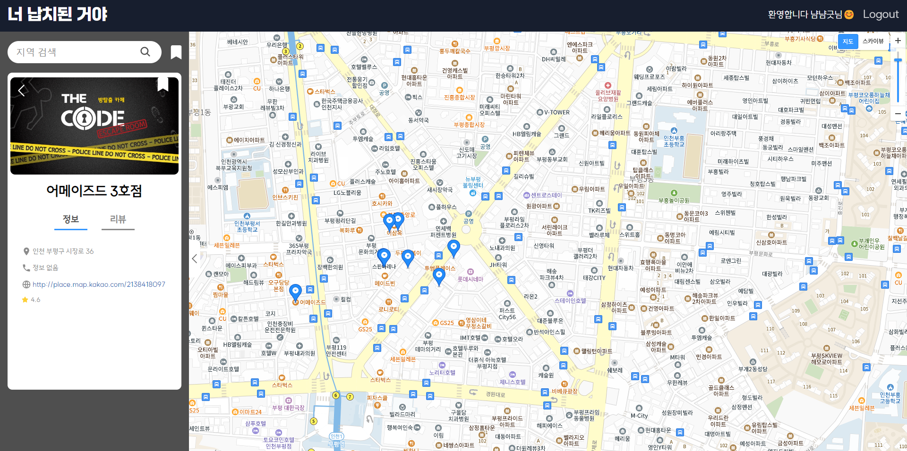
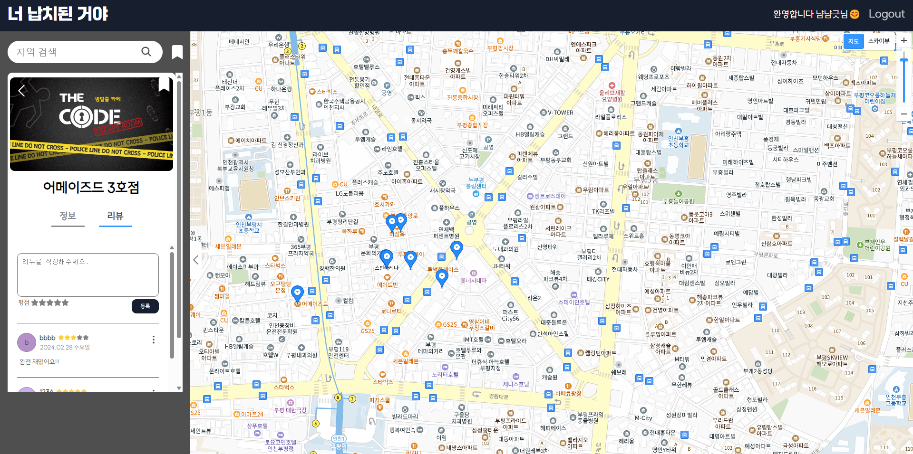

# Kidnapped - "너 납치된 거야"

<p align="center">
  
</p>
<p align="center">
전국 방탈출 카페 검색 & 리뷰 웹서비스
</p>

# Kidnapped Web Page v0.1.0

> 내일배움캠프 React 4기 원장님 4랑해조❤️<br/>
> 개발기간 : 2024.02.23 ~ 2024.02.28

## 🔗 배포주소

> 정식 배포 페이지 : https://kidnapped.vercel.app

## 🏃 웹개발팀 소개

|                              서지원                              |                              신서연                              |                                                 박시은                                                 |                                                 김지민                                                 |                                                 남지현                                                 |
| :--------------------------------------------------------------: | :--------------------------------------------------------------: | :----------------------------------------------------------------------------------------------------: | :----------------------------------------------------------------------------------------------------: | :----------------------------------------------------------------------------------------------------: |
|  |  |  |  |  |
|             [@seopport](https://github.com/seopport)             |         [@seoyeon-1206](https://github.com/seoyeon-1206)         |                             [@MyNameSieun](https://github.com/MyNameSieun)                             |                               [@gggimmmin](https://github.com/gggimmmin)                               |                                [@jihyun-N](https://github.com/jihyun-N)                                |
|                            Front-End                             |                            Front-End                             |                                               Front-End                                                |                                               Front-End                                                |                                               Front-End                                                |
|                               리더                               |                               팀원                               |                                                  팀원                                                  |                                                  팀원                                                  |                                                  팀원                                                  |

## 🚩 프로젝트 소개

Kidnapped - "너납치된거야" 웹 서비스는 전국의 방탈출 카페를 지도를 통해 보여주는 서비스입니다. <br/>
특정 지역명 검색을 통해 그 지역에 어떤 방탈출 카페가 있는지 보여주며, 단순하게 카페 리스트만 보여주는<br/>
것이 아닌, 상세 페이지를 통해 해당 방탈출 카페의 별점과 생생한 리뷰를 볼 수 있습니다.

## 🛠️ 시작 가이드

### Installation

```
$ git clone https://github.com/seopport/Kidnapped.git
$ cd Kidnapped
```

#### 환경 변수 설정

root 디렉토리에 .env 파일을 생성하고 환경변수를 입력 후 저장해주세요.

```
REACT_APP_KAKAO_KEY = 카카오맵 API Key
REACT_APP_SERVER_REVIEWS_URL = http://localhost:4000/reviews
REACT_APP_SERVER_SCRAPS_URL = http://localhost:4000/scraps
```

#### Frontend

```
$ cd Kidnapped
$ yarn install
$ yarn json
$ yarn start
```

# 📚 Stacks

### Environment


### Config


### Development


### Hosting


### Communication


<br />

## 🗂️ 디렉토리 구조

```
src
 ┣ api
 ┃ ┣ index.js
 ┃ ┣ reviewApi.js
 ┃ ┗ scrapApi.js
 ┣ assets
 ┃ ┣ backgroungimg.png
 ┃ ┣ font.css
 ┃ ┣ left.png
 ┃ ┗ right.png
 ┣ components
 ┃ ┣ common
 ┃ ┃ ┣ CalculateGrade.jsx
 ┃ ┃ ┣ Layout.jsx
 ┃ ┃ ┗ LoadingSpinner.jsx
 ┃ ┣ Detail.jsx
 ┃ ┣ Header.jsx
 ┃ ┣ MapLoader.jsx
 ┃ ┣ Review.jsx
 ┃ ┗ SideBar.jsx
 ┣ hooks
 ┃ ┗ useForm.js
 ┣ pages
 ┃ ┣ HomePage.jsx
 ┃ ┗ LoginPage.jsx
 ┣ redux
 ┃ ┣ config
 ┃ ┃ ┗ configStore.js
 ┃ ┗ modules
 ┃ ┃ ┣ authSlice.js
 ┃ ┃ ┣ reviewSlice.js
 ┃ ┃ ┗ scrapSlice.js
 ┣ shared
 ┃ ┗ Router.jsx
 ┣ styles
 ┃ ┣ GlobalStyle.jsx
 ┃ ┗ theme.js
 ┣ util
 ┣ App.jsx
 ┣ App.test.js
 ┣ index.jsx
 ┣ logo.svg
 ┣ reportWebVitals.js
 ┗ setupTests.js
```

<br />

## 💻 화면 구성

|             로그인 페이지              |              메인 페이지               |
| :------------------------------------: | :------------------------------------: |
|    |      |
|              상세 페이지               |              리뷰 페이지               |
|  |  |

## 📦 주요 기능

#### ⭐️ 로그인 기능

- 로그아웃 상태에서도 방탈출 카페의 검색 및 상세 정보 조회 기능을 사용할 수 있습니다.
- 로그인을 원할 경우, 헤더에 위치한 로그인 버튼을 클릭하면 로그인 페이지로 이동합니다.
- 로그인 후 사용자는 자동으로 홈 페이지로 이동하며, 헤더에 표시된 사용자의 닉네임을 통해 현재 로그인 상태를 확인할 수 있습니다.
- 아직 회원이 아니라면, 아이디, 비밀번호, 닉네임을 입력하여 회원가입을 진행할 수 있습니다.
- 회원가입 과정에서 유효하지 않은 정보를 입력한 경우, 알림창이 표시됩니다.
- 스크랩, 리뷰 작성 등의 회원 정보가 필요한 기능들은 로그인하거나 회원가입을 완료한 후에 이용 가능합니다.

#### ⭐️ 메인 페이지

- 키워드 검색 시 해당하는 방탈출 카페 리스트를 조회할 수 있습니다.
- 현재 위치를 받아와 지도에 보여줍니다.
- 현재 위치에서 가까운 거리 순으로 방탈출 카페 리스트를 조회할 수 있습니다.
- 특정 방탈출 카페를 누르면 상세 정보를 볼 수 있습니다.
- 상단의 스크랩 아이콘을 누르면 스크랩한 방탈출 카페 리스트를 조회할 수 있습니다.

#### ⭐️ 디테일

- 선택한 방탈출 카페 위치로 지도가 이동합니다.
- 방탈출 카페의 정보와 리뷰를 탭을 통해 조회할 수 있습니다.
- 정보 탭을 누르면 방탈출 카페의 이름, 주소, 전화번호, 웹사이트 주소, 평점을 확인할 수 있습니다.
- 리뷰 탭을 누르면 방탈출 카페의 리뷰들을 조회하고 리뷰를 남길 수 있습니다.
- 이름 옆 스크랩 아이콘 클릭 시 방탈출 카페를 스크랩 목록에 추가하거나 삭제할 수 있습니다.

#### ⭐️ 리뷰

- 리뷰 탭에서는 방탈출 카페에 대한 리뷰를 확인할 수 있습니다.
- 사용자는 방탈출 카페에 대해 자신의 리뷰를 작성, 수정, 삭제할 수 있습니다.
- 사용자는 리뷰 내용과 평점을 입력하여 리뷰를 등록할 수 있습니다.
- 등록된 리뷰들은 최신 순으로 정렬되어 표시됩니다.
- 사용자는 자신이 등록한 리뷰에 한해 수정 및 삭제 권한을 가집니다.
- 리뷰를 수정할 때는 리뷰의 내용과 평점 모두 수정이 가능합니다.
- 리뷰를 등록할 때 입력한 평점은 각 방탈출 카페의 평균 평점 계산에 반영됩니다.
